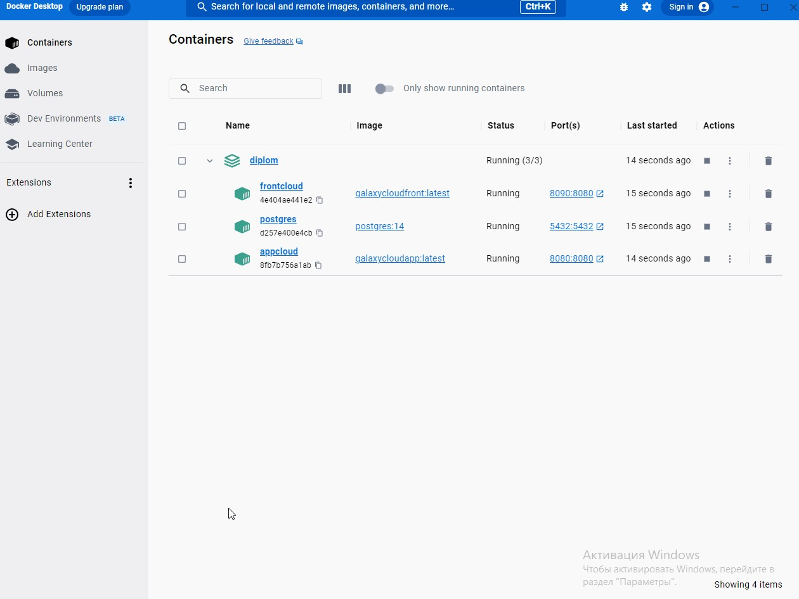
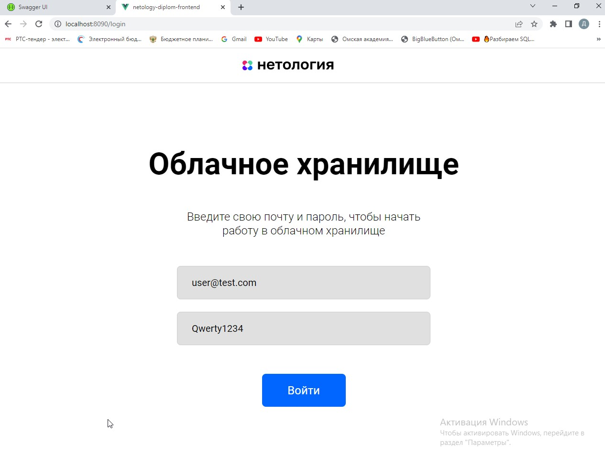
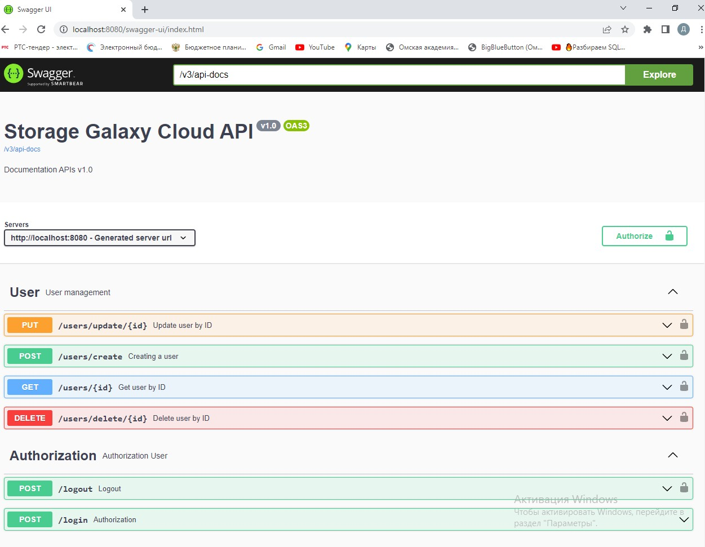
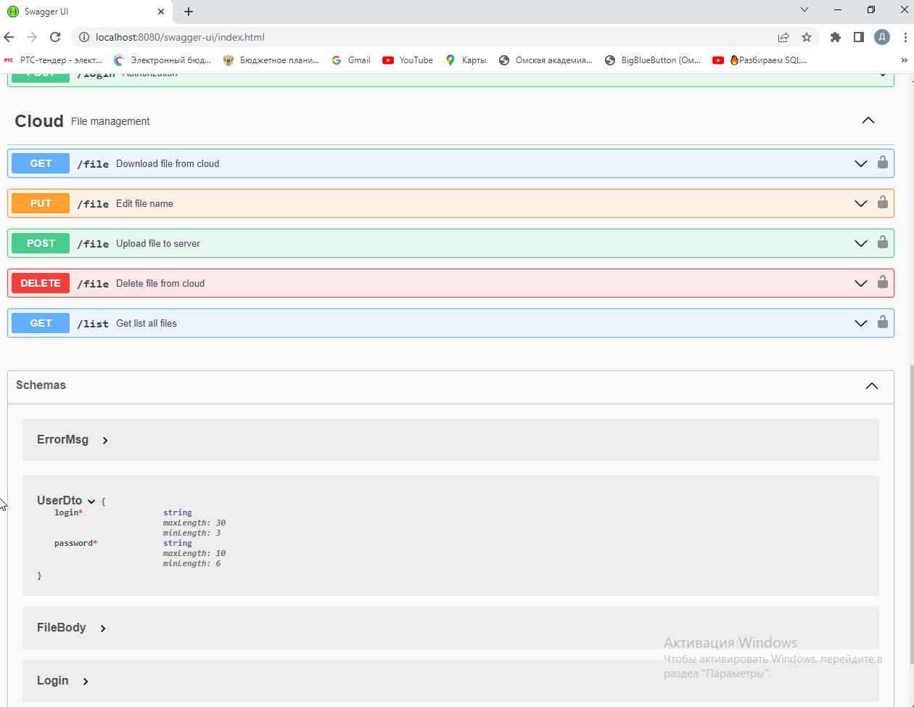

## Запуск приложения GalaxyCloud с помощью файла docker-compose.yml (Dockerfile) (frontendApp + backendApp + postgres)
- Запускаем приложение [Docker Desktop](https://www.docker.com/products/docker-desktop/);
- Запускаем терминал в папке `/GalaxyCloud` и собираем jar архив с нашим Spring REST приложением:
- ```mvn clean package -Dskiptests``` or ```mvn clean package -Dmaven.test.skip```
- После успешной сборки в папке будет находиться jar файл:`/GalaxyCloud/target/GalaxyCloud-0.0.1-SNAPSHOT.jar`
- В терминале выполнить команду по сборке images и containers: 
- ```docker-compose up```
- В докере запустятся 3 приложения:
- Backend App Java 11 -> ```http://localhost:8080```
- Frontend App Node 15 -> ```http://localhost:8090```
- Database Postgres 14 -> ```http://localhost:5432```

- Запуск тестов: `mvn test` 

## Документация и проверить app Storage Galaxy Cloud API можно c помощью swagger:
### ```http://localhost:8080/swagger-ui/index.html```
### ```http://localhost:8080/v3/api-docs```

## Для тестирования frontend + backend + postgres нужно перейти по ссылке и ввести:
### `http://localhost:8090/login`
### логин `user@test.com` 
### пароль: `Qwerty1234`


- Выход из приложения: в терминале нажать "Ctrl+C"
- Удаление Docker контейнера: ```docker-compose down```


`http://localhost:8080/users/create`

`{
"login": "admin@test.com",
"password": "Qwerty1111"
}`

`{
"login": "admin@test.com",
"password": "$2a$12$pBqGg4hhFmlYJuRCNadI3ehWlX6EnLdpHgQRnkIinsh6rIPm6ZbyC"
}`

## Для тестирования backend + postgres нужно авторизовать пользователя:
 - Отправить POST запрос `http://localhost:8080/login`
 - JSON -> `{
"login": "user@test.com",
"password": "Qwerty1234"
}`
 - Полученный в ответ auth-token ввести в окно `Authorize` 

## Если в Базе Данных postgres нет этого пользователя, то нужно создать пользователя 
- Отправить POST запрос `http://localhost:8080/users/create`
- JSON -> `{
  "login": "user@test.com",
  "password": "Qwerty1234"
  }`




## Описание проекта

Проект - REST интерфейс для возможности загрузки файлов и вывода списка уже загруженных файлов пользователя.
Все запросы к сервису - авторизованы.